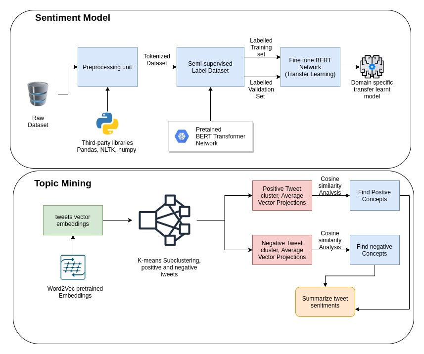
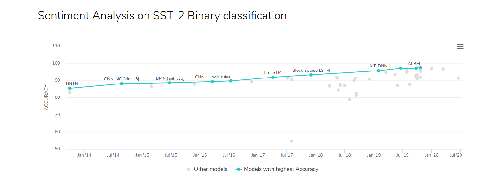

# Senitments-Mining
A semi-supervised BERT based Sentiment classification model and Sentiment cluster mining model.

### Semi-supervised_tweet.ipynb : 
* Cleans the dataset, tokenizes it and loads a pretrained BERT sentiment classification model to generate labels for the unlabelled tweets.
* Generates the training and validation set with labels.
### Transfer-Learn-BERT.ipynb : 
* Loads the labelled dataset and fine-tunes the BERT sentiment model to our specific domain and target variables.
* The trained model achieves test accuracy of `92.48%` with 2 epochs of training(can be improved with further training and hyperparameter tuning).
* Stores the transfer-learnt model.
### Topic-Analysis.ipynb : 
* Loads the labelled dataset, splits the dataset into positive and negative tweets, generates word2vec based wordembeddings using pretrained `GoogleNews-vectors-negative300` embeddings.
* The positive and negative tweets words embeddings used to create sub-clusters.
* Average vector representation of tweets generated per cluster
* Cosine similarity analysis of each tweet with the cluster's centriod.
* Top 99 percentile cosine similarity tweets per cluster are filtered and are analyzed for topic correlation.
* Each cluster is assigned a topic.

## How to run

* Download the sentiment dataset of concern and create a dir named raw_dataset, unzip and place the csv(edit for other formats).
* The preprocessing scripts has arguments as column names for which columns to process for semi-supervised training. 
* Create directories models, processed_dataset under Sentiment-Mining.
* Please the comments in the notebook for elaborative understanding.
* For dependencies check the top cell of each of the notebooks.

## Reference

* [Hugging face transformers](https://github.com/huggingface/transformers)
* [Sentiment Analysis on SST-2 Binary classification](https://paperswithcode.com/sota/sentiment-analysis-on-sst-2-binary)

 
